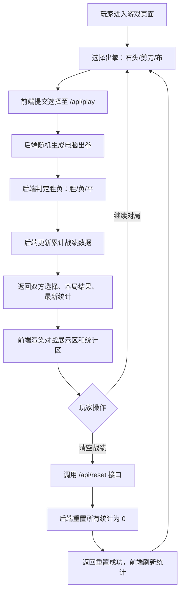

## 1. 产品概述
本项目为一款单人对战电脑的休闲 H5 小游戏——石头剪刀布，主打轻松休闲的单机对局体验。玩家通过前端选择出拳，与后端随机生成的电脑出拳进行对决，实时累计战绩统计。
- **目标用户**：追求轻松娱乐、打发碎片时间的普通用户
- **核心价值**：零门槛、无负担的纯休闲对战体验，去除冗余功能，聚焦纯粹对局乐趣

## 2. 核心功能

### 2.1 用户角色
| 角色 | 注册方式 | 核心权限 |
|------|----------|----------|
| 玩家 | 无需注册，直接进入游戏 | 选择出拳、查看战绩、清空战绩 |

### 2.2 功能模块
1. **游戏主页面**：出拳选择区、对战结果展示区、战绩统计区、清空战绩按钮
2. **后端对战服务**：随机出拳逻辑、胜负判定、战绩数据维护、清空接口

### 2.3 页面详情
| 页面名称 | 模块名称 | 功能描述 |
|----------|----------|----------|
| 游戏主页面 | 出拳选择区 | 石头/剪刀/布 三个选项按钮，点击后提交至后端 |
| 游戏主页面 | 对战展示区 | 显示玩家出拳、电脑出拳、本局结果（胜/负/平），含动画效果 |
| 游戏主页面 | 战绩统计区 | 实时显示总胜场、总负场、总平局数 |
| 游戏主页面 | 清空战绩按钮 | 一键重置所有战绩数据为 0，重新开始游玩 |

## 3. 核心流程
玩家进入游戏页面 → 点击石头/剪刀/布任一选项 → 前端将选择提交至后端接口 → 后端随机生成电脑出拳 → 后端按照规则判定胜负并更新累计战绩 → 后端返回双方选择、本局结果、最新统计 → 前端渲染展示结果和统计数据 → 玩家可继续对局或点击清空战绩重置。

## 4. 用户界面设计

### 4.1 设计风格
- **主色调**：温暖橙色系 `#FF6B35` 作为主色，搭配活力蓝 `#4ECDC4` 辅助色，背景使用柔和渐变
- **按钮风格**：大圆角 3D 立体按钮，悬浮有上浮动画，点击有按压反馈
- **字体**：标题使用圆润有活力的显示字体，正文使用清晰易读的无衬线字体
- **布局风格**：居中卡片式布局，分层级卡片承载不同功能模块
- **图标风格**：使用 Emoji 作为出拳图标（✊ ✋ ✌️），搭配手写风装饰元素

### 4.2 页面设计概述
| 页面名称 | 模块名称 | UI 元素 |
|----------|----------|---------|
| 游戏主页面 | 标题区 | 大号游戏名称「石头剪刀布」，副标题「休闲对战」，入场渐显动画 |
| 游戏主页面 | 出拳选择区 | 三个大号圆形按钮并排，内有 Emoji 图标和文字标签，悬浮放大效果 |
| 游戏主页面 | 对战展示区 | 左右分栏展示玩家和电脑选择，中间 VS 标识，下方醒目胜负结果文字 |
| 游戏主页面 | 战绩统计区 | 三个统计卡片并排（胜/负/平），数字大号突出，有渐变背景 |
| 游戏主页面 | 清空按钮 | 卡片底部右侧，次按钮样式，点击有二次确认弹窗 |

### 4.3 响应式
- **桌面端优先**，使用 Tailwind 响应式断点适配移动端
- 移动端出拳按钮竖向排列，保证触控区域 ≥ 48px
- 所有交互元素支持触控操作，优化移动端体验

### 4.4 动画与交互
- 出拳按钮点击后先缩放反馈，再触发对战动画
- 电脑出拳展示前有「思考中...」的摇摆动画效果
- 结果揭晓时有颜色闪烁高亮动画
- 统计数字变化时有滚动递增动画
