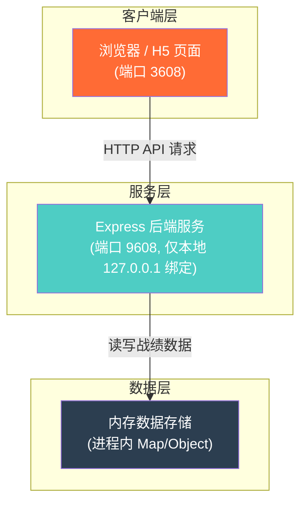
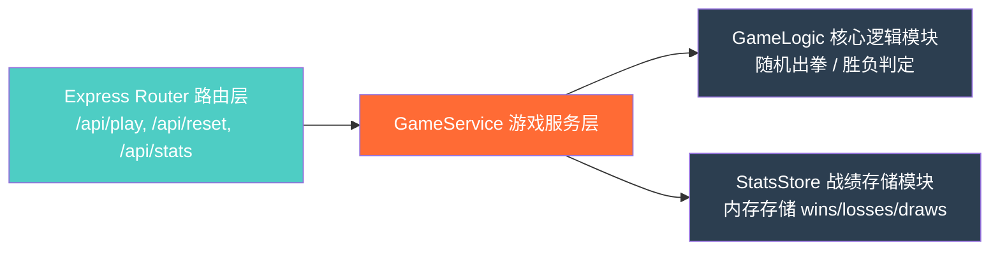
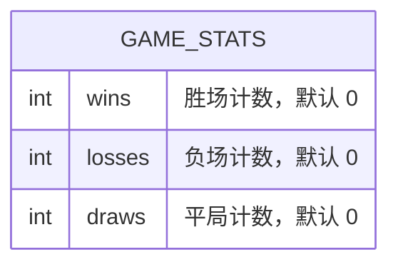

## 1. 架构设计



## 2. 技术选型说明
- **前端**：React@18 + TypeScript + Vite@6 + TailwindCSS@3 + Zustand
- **前端初始化工具**：vite-init
- **后端**：Express@4 + TypeScript（ESM 格式）
- **数据库**：无独立数据库，战绩数据使用进程内内存存储（轻量化需求，无需持久化）
- **状态管理**：Zustand 管理前端游戏状态
- **HTTP 通信**：fetch API 调用后端接口

## 3. 路由定义
| 路由路径 | 用途说明 |
|----------|----------|
| / | 游戏主页面（包含所有功能模块） |

## 4. API 接口定义

### 4.1 类型定义

```typescript
// 出拳选择类型
type Choice = 'rock' | 'paper' | 'scissors';

// 对局结果类型
type Result = 'win' | 'lose' | 'draw';

// 战绩统计数据
interface GameStats {
  wins: number;      // 胜场数
  losses: number;    // 负场数
  draws: number;     // 平局数
}

// 对局请求参数
interface PlayRequest {
  playerChoice: Choice;
}

// 对局响应结果
interface PlayResponse {
  playerChoice: Choice;    // 玩家出拳
  computerChoice: Choice;  // 电脑出拳
  result: Result;          // 本局结果
  stats: GameStats;        // 最新累计战绩
}

// 清空战绩响应
interface ResetResponse {
  success: boolean;
  stats: GameStats;        // 重置后的战绩（全为 0）
}
```

### 4.2 接口列表

| 接口方法 | 接口路径 | 请求体 | 响应体 | 说明 |
|----------|----------|--------|--------|------|
| POST | /api/play | `PlayRequest` | `PlayResponse` | 提交玩家出拳，进行一局对战 |
| POST | /api/reset | - | `ResetResponse` | 清空所有战绩，重置为 0 |
| GET | /api/stats | - | `GameStats` | 获取当前累计战绩统计 |

### 4.3 后端服务配置
- **绑定地址**：`127.0.0.1`（仅允许本地访问，禁止外网连接）
- **监听端口**：`9608`
- **CORS 配置**：允许 `http://localhost:3608` 和 `http://127.0.0.1:3608` 跨域访问
- **请求体大小限制**：100KB（仅接收小体量 JSON 数据）

### 4.4 前端开发服务器配置
- **监听端口**：`3608`
- **主机绑定**：`0.0.0.0`（兼容本地访问测试）
- **API 代理**：开发模式下将 `/api` 请求代理至 `http://127.0.0.1:9608`

## 5. 服务端内部架构



### 模块职责
- **路由层**：定义 HTTP 端点、参数校验、响应序列化
- **游戏服务层**：组织对战流程，协调逻辑模块和存储模块
- **核心逻辑模块**：
  - 随机出拳：等概率生成 rock/paper/scissors
  - 胜负判定：石头胜剪刀、剪刀胜布、布胜石头，相同为平
- **战绩存储模块**：维护 wins、losses、draws 三个计数器，提供读取和重置方法

## 6. 数据模型（内存存储）

### 6.1 数据结构定义



### 6.2 说明
- 数据存储于 Node.js 进程内存中，进程重启后数据重置
- 无持久化需求（符合休闲游戏「轻量」定位）
- 因仅单用户本地使用，无需用户隔离或加锁机制
- 如需持久化可后续扩展至 JSON 文件或 SQLite，当前版本不实现
